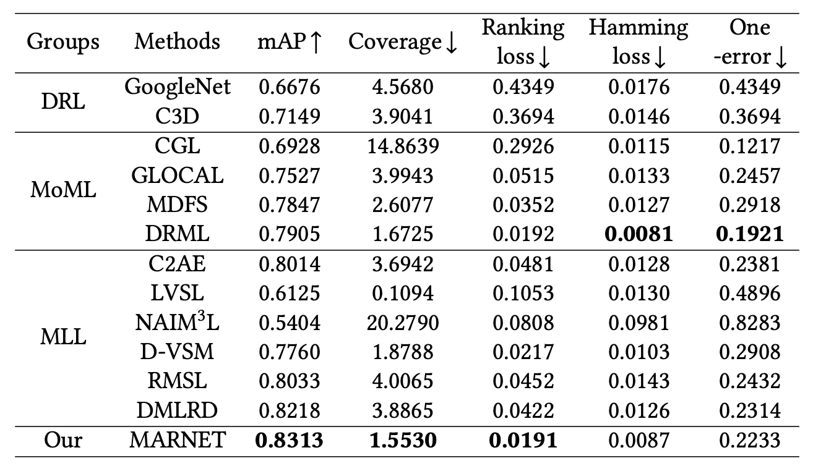
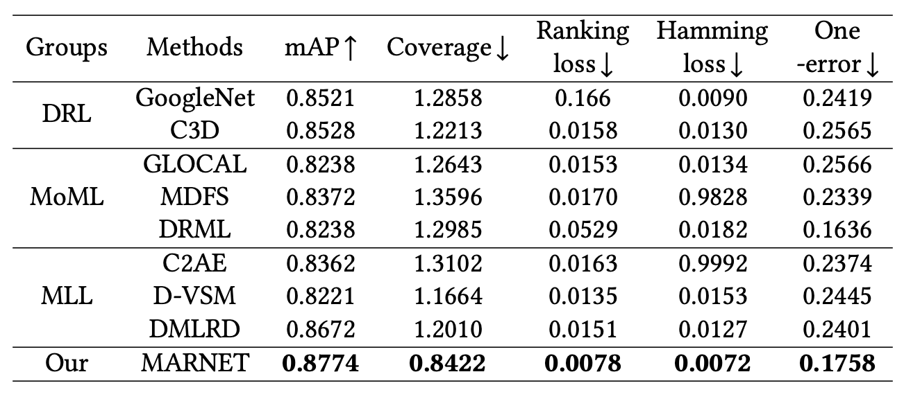

# Multimodal Attentive Representation Learning for Micro-video Multi-label Classification

## Abstract
As one of the representative types of user-generated contents (UGCs) in social platforms, micro-videos have been becoming popular in our daily life. Although micro-videos naturally exhibit multimodal features that are rich enough to support representation learning, the complex correlations across modalities
render valuable information difficult to integrate.
In this paper, we introduced a multimodal attentive representation Network (MARNET) to
learn complete and robust representations to benefit micro-video multi-label classification.
To address the commonly missing modality issue, we presented a multimodal information aggregation mechanism module to integrate multimodal information, where latent common representations are obtained by modeling the complementarity and consistency in terms of visual-centered modality groupings instead of single modalities. For the label correlation issue, we designed an attentive graph neural network module to adaptively learn the correlation matrix and representations of labels for better compatibility with training data.
In addition, a cross-modal multi-head attention module is developed to make the learned common representations label-aware for multi-label classification. Experiments conducted on two micro-video datasets demonstrate the superior performance of MARNET compared with state-of-the-art methods.

## Method


## Results
Classification performance comparison between MARNET and several state-of-the-art methods on the MTSVRC micro-video dataset.



Classification performance comparison between MARNET and several state-of-the-art methods on the manually labeled UCF101 dataset.


## Run
add args config

```yaml

    train_label_dir: your training label path.
    train_visual_dir: your training vision modality path.
    train_audio_dir: your training audio modality path.
    train_tra_dir: your training trajectory modality path.
    test_label_dir: your test label path.
    test_visual_dir: your test vision modality path.
    test_audio_dir: your test audio modality path.
    test_tra_dir: your test trajectory modality path.
    labelgcn_name: your labelVectorization path.
    adj: your adjacency matrix path.
    logger_name: your tensorboard log dir.
    curve_tensorb: your visualization curve dir.
    log_dir: your log dir.
    correlation_matrix: your generate path of correlation_matrix.
    representions: your representation path.
```

Train

```shell
python train.py your_args_path
```

Test

```shell
python train.py your_args_path
```

## Citation
Jing P, Liu X, Zhang L, et al. Multimodal Attentive Representation Learning for Micro-video Multi-label Classification[J]. ACM Transactions on Multimedia Computing, Communications and Applications, 2024.

```
@article{MARNet,
author = {Jing, Peiguang and Liu, Xianyi and Zhang, Lijuan and Li, Yun and Liu, Yu and Su, Yuting},
title = {Multimodal Attentive Representation Learning for Micro-video Multi-label Classification},
year = {2024},
issue_date = {June 2024},
publisher = {Association for Computing Machinery},
address = {New York, NY, USA},
volume = {20},
number = {6},
issn = {1551-6857},
url = {https://doi.org/10.1145/3643888},
doi = {10.1145/3643888},
journal = {ACM Trans. Multimedia Comput. Commun. Appl.},
month = {mar},
articleno = {182},
numpages = {23},
keywords = {Micro-video, multimodal representations, multi-label, graph network}
}
```